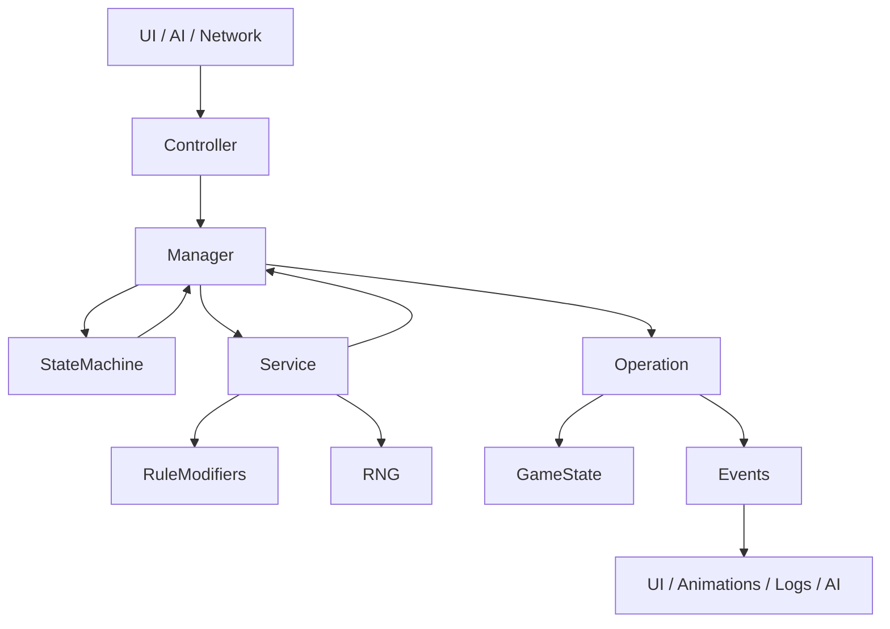

# 🧠 Game Architecture Rules (AI-Readable)

## Core Goal

> **Separate intent, flow, rules, and state mutation so the game remains testable, deterministic, and extensible.**

---

# 1️⃣ Controller

### Purpose

**Translate external input into a game intent.**

### Responsibilities

* Accept input from UI / AI / Network
* Validate input shape (IDs exist, format correct)
* Forward intent to a Manager

### Must NOT

* Contain game rules
* Roll dice
* Mutate game state
* Know turn order or legality

### Typical Use Cases

* Player clicks “Block”
* AI chooses an action
* Network command received

### Smells 🚨

* Rule logic
* State mutation
* Dice rolling
* Skill checks

---

# 2️⃣ Manager

### Purpose

**Orchestrate game flow and sequencing.**

### Responsibilities

* Enforce turn & phase rules
* Decide *when* things happen
* Coordinate Services + Operations
* Create Decisions when player input is required

### Must NOT

* Contain detailed rule math
* Apply atomic state changes directly
* Become skill-specific

### Typical Use Cases

* Execute a Block action
* Handle Player Activation lifecycle
* Resolve multi-step actions

### Smells 🚨

* Large rule calculations
* Direct state mutation
* Long `if/else` chains for skills

---

# 3️⃣ Service

### Purpose

**Contain pure game rules and calculations.**

### Responsibilities

* Implement rulebook logic
* Be stateless or near-stateless
* Accept context objects
* Return computed results

### Must NOT

* Mutate game state
* Control flow or sequencing
* Know about UI or turns

### Typical Use Cases

* Calculate block dice
* Resolve skill interactions
* Compute odds for AI or UI

### Smells 🚨

* Writing to state
* Reading global game phase
* UI-related logic

---

# 4️⃣ Operation (Command)

### Purpose

**Apply one atomic, deterministic state change.**

### Responsibilities

* Mutate game state
* Be replayable and undoable
* Emit domain events

### Must NOT

* Contain rule logic
* Decide *if* something should happen
* Call other operations

### Typical Use Cases

* Knock down a player
* Push a player
* Roll armor or injury
* End activation

### Smells 🚨

* Skill checks
* Branching rule logic
* Multi-step behavior

---

# 5️⃣ Domain Events

### Purpose

**Announce what happened, not decide what happens next.**

### Responsibilities

* Notify UI, animation, sound, logs, AI
* Be immutable and descriptive

### Must NOT

* Trigger game logic directly
* Mutate state

### Typical Use Cases

* PlayerKnockedDown
* BlockResolved
* TurnEnded

### Smells 🚨

* Game logic in event listeners
* Events controlling flow

---

# 6️⃣ State Machine

### Purpose

**Enforce legal phases and sub-phases.**

### Responsibilities

* Track current game phase
* Validate allowed actions per phase

### Must NOT

* Contain rule math
* Perform mutations

### Typical Use Cases

* Turn phases
* Action sub-steps
* Dice selection windows

### Smells 🚨

* Boolean flags everywhere
* Controllers checking phase logic

---

# 7️⃣ Rule Modifiers / Strategy Objects

### Purpose

**Model skills and special rules as composable logic.**

### Responsibilities

* Modify rule contexts
* Be discoverable and orderable

### Must NOT

* Mutate game state directly
* Control flow

### Typical Use Cases

* Block, Dodge, Wrestle
* Mutations, traits, inducements

### Smells 🚨

* Giant `switch(skill)`
* Hardcoded skill interactions

---

# 8️⃣ Decision Objects

### Purpose

**Represent moments where a player must choose.**

### Responsibilities

* Describe choice + options
* Pause manager execution

### Must NOT

* Contain UI logic
* Execute game effects

### Typical Use Cases

* Select block die
* Follow up or not
* Choose push square

### Smells 🚨

* UI branching game logic
* Managers waiting on hacks

---

# 9️⃣ Deterministic RNG

### Purpose

**Ensure replays, AI simulation, and multiplayer sync.**

### Responsibilities

* Provide seeded randomness
* Log rolls

### Must NOT

* Be accessed directly by UI
* Use global randomness

### Typical Use Cases

* Dice rolls
* Injury tables

### Smells 🚨

* `Math.random()`
* Hidden randomness

---

# 🔗 How They Interact (Mermaid Diagram)

---

# 🧠 Global AI Rules (Copy-Paste Friendly)

**When adding a new feature, the AI must:**

1. Start at the **Controller** (intent only)
2. Delegate sequencing to a **Manager**
3. Put rule logic in **Services**
4. Apply state changes via **Operations**
5. Emit **Events**, never UI calls
6. Use **RNG Service** for all randomness
7. Represent choices as **Decision Objects**
8. Never mix responsibilities across layers
