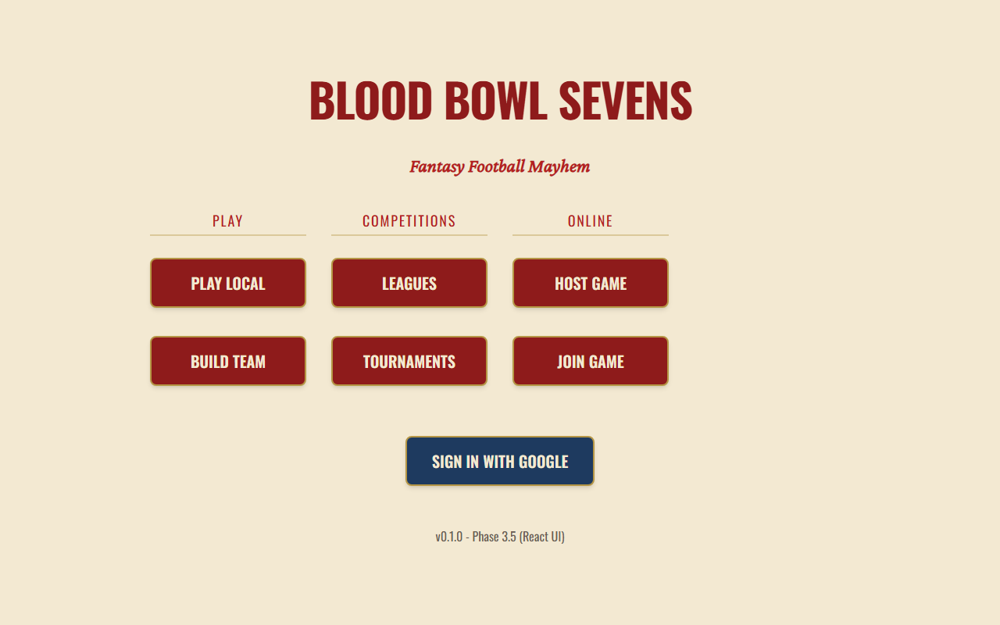
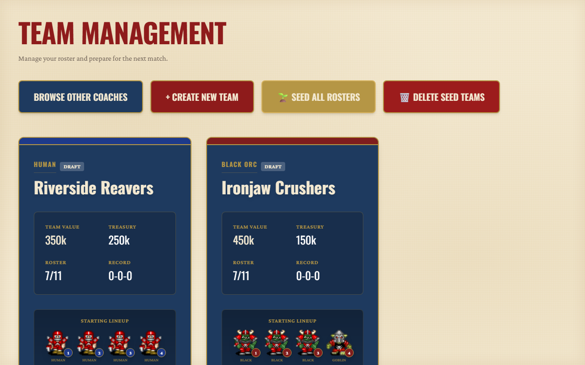
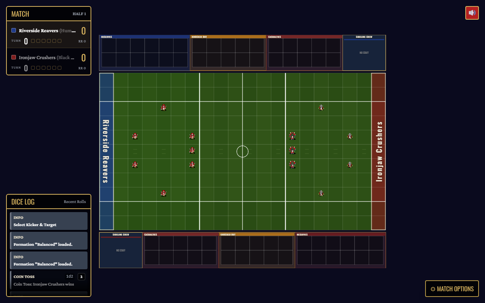

# Blood Bowl Sevens

A browser implementation of **Blood Bowl Sevens** (2025 rules) — the fast,
7-a-side variant of the tabletop fantasy football game. Phaser 3 renders the
pitch, React drives every menu and HUD, and the rules engine underneath is
fully headless: the same match logic runs in the browser, from the terminal,
or as a JSON protocol for scripted/AI play.



## Features

- **107 skills and traits implemented** against the 2025 rulebook, each
  locked in with seeded scenario tests (`__tests__/headless/rules/gate.test.ts`
  is the coverage source of truth).
- **Full match flow**: coin toss, setup with saved/preset formations,
  kick-off event table, blocking, passing, fouling, injuries, SPP and
  player advancement, touchdowns and drive resets.
- **Team management & competitions**: build and manage rosters across every
  roster in the game, run Leagues (Matched Play / Advanced League) and
  Tournaments (Sevens Skill Selection), with career stats tracked per player.
- **Online multiplayer** via Firebase — host/join with a shareable code,
  cloud team library, in-match chat — or play entirely offline in local
  hotseat mode with no account needed.
- **Headless engine + JSON protocol** (`pnpm headless`) so the whole game can
  be driven from the terminal or by a scripted/AI client, independent of the
  browser UI.
- **Sandbox & scenario-case tooling** for reproducing and regression-testing
  individual rules interactions.

## Screenshots

| Team management | Live match |
| --- | --- |
|  |  |

## Development

```bash
pnpm install
pnpm dev          # Vite dev server
pnpm test         # Vitest unit tests
pnpm headless     # play a game in the terminal (add --json for AI stdio mode)
```

### Testing

The full test suite is Vitest (unit) plus a three-lane Playwright E2E suite
— see [`docs/E2E_TESTING.md`](docs/E2E_TESTING.md) for details:

```bash
pnpm test              # unit tests
pnpm e2e:engine        # headless scenario matrix, no browser
pnpm e2e:browser       # real Chromium against the dev build
pnpm e2e:visual        # screenshot regression checks
```

## Online multiplayer (Firebase)

Online play (host/join, cloud team library, chat) uses Firebase: Auth (Google
sign-in), Firestore (lobbies + message bus), and Cloud Functions (edge
validation). Without Firebase config the app still runs — local hotseat play
and team building work signed-out; only Host/Join require it.

### Setup

1. Create a Firebase project at <https://console.firebase.google.com>.
2. Enable **Authentication → Google** provider.
3. Enable **Firestore** (production mode; rules ship in `firestore.rules`).
4. Add a **Web app** in Project settings and copy its config into `.env.local`
   (see `.env.example` for the variable names).
5. Deploy the security rules (free Spark plan):
   `npm i -g firebase-tools`, `firebase login`, then
   `firebase deploy --only firestore:rules`.
   **Do not deploy functions** unless you've upgraded to Blaze — Cloud
   Functions can't be deployed on the free plan, and the game fully works
   without them (join is a client-side transaction enforced by the rules;
   the Function is an optional extra validation layer).
6. Recommended: enable a Firestore **TTL policy** on the `games` collection's
   `expiresAt` field (console → Firestore → TTL) so abandoned lobbies are
   reaped automatically. Cleanly finished matches delete themselves.

### Local emulators

```bash
firebase emulators:start --only auth,firestore   # auth :9099, firestore :8080
# then set VITE_FIREBASE_USE_EMULATORS=true in .env.local
```

## Deploy (Netlify)

`netlify.toml` configures the deploy: it builds with `vite build` (skipping the
`tsc` gate, which has pre-existing UI-layer errors), publishes `dist`, adds the
SPA fallback so react-router deep links like `/online/play/ABC123` resolve, and
sets the `Cross-Origin-Opener-Policy: same-origin-allow-popups` header the
Google sign-in popup needs. Connect the repo in Netlify and it just builds.

For online play to work on the deployed site you must also:

1. **Netlify env vars** — set the `VITE_FIREBASE_*` values (from `.env.example`)
   in Netlify → Site settings → Environment variables. Vite inlines these at
   **build time**, so trigger a redeploy after adding them. Without them the
   site still runs, but Host/Join stay disabled.
2. **Custom subdomain** — add it in Netlify (Domain settings) and point the DNS
   from `joe-lloyd.com`. (You said you'll handle this part.)
3. **Firebase Auth → Authorized domains** *(the allow-list step)* — in the
   Firebase console → Authentication → Settings → **Authorized domains**, add
   both the Netlify domain (`your-site.netlify.app`) and the custom subdomain.
   Google sign-in (`signInWithPopup`) is **rejected on any domain not on this
   list** — this is the most common "sign-in silently fails after deploy" cause.
4. **Rules** — `firebase deploy --only firestore:rules` if you haven't since the
   last rules change (the `users/{uid}` profile/active-match rule, etc.).

Firestore itself has no domain allow-list — access is gated by auth + rules, so
no rules change is needed for a new domain; only the Auth authorized-domains
list matters.

### Security model (read this before worrying about the API key)

The Firebase client config in `.env.local` is **publishable, not secret** —
every Firebase web app ships it to the browser. Security is enforced by:

- **Firestore rules** (`firestore.rules`): your team library is owner-only;
  only a game's two members can write to it; chat/command messages must be
  `from` the authenticated writer and are append-only.
- **Cloud Functions** (`functions/`): validate lobby create/join and roster
  legality. They do *not* run gameplay — the host browser is authoritative
  (friends-play trust model), which keeps Function invocations rare and the
  whole stack inside Firebase's free (Spark) tier.

### Cost posture

Turn-based play writes a handful of Firestore docs per turn and calls a
Function only at lobby create/join. No per-second writes (the turn timer is
derived client-side from a stored deadline), one snapshot listener per client,
and finished games are cleaned up — designed to stay free.
