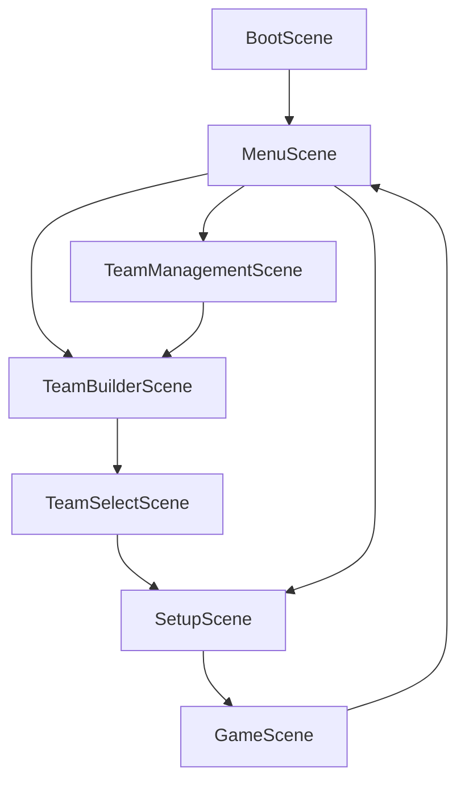

# Blood Bowl Phaser.js - Technical Architecture

## 🏗️ System Overview

The Blood Bowl Phaser.js game is built using a layered architecture that separates concerns between presentation, business logic, and data management.

## 📐 Current Architecture

### High-Level Structure

```
┌─────────────────────────────────────────────────────────┐
│                   Presentation Layer                     │
│  (Phaser Scenes, UI Components, Visual Rendering)       │
├─────────────────────────────────────────────────────────┤
│                   Business Logic Layer                   │
│  (Game State, Turn Management, Validation)               │
├─────────────────────────────────────────────────────────┤
│                      Data Layer                          │
│  (Types, Models, Roster Templates)                       │
└─────────────────────────────────────────────────────────┘
```

## 📂 Directory Structure

```
src/
├── config/              # Game configuration
│   └── GameConfig.ts    # Canvas size, grid dimensions, colors
│
├── scenes/              # Phaser scenes (presentation layer)
│   ├── BootScene.ts     # Initial loading
│   ├── MenuScene.ts     # Main menu
│   ├── TeamManagementScene.ts
│   ├── TeamBuilderScene.ts
│   ├── TeamSelectScene.ts
│   ├── SetupScene.ts    # Pre-game player placement
│   └── GameScene.ts     # Main gameplay
│
├── game/                # Game-specific components
│   ├── GameStateManager.ts      # Core state management
│   ├── Pitch.ts                 # Game board rendering
│   ├── PlayerSprite.ts          # Player visualization
│   ├── PlayerInfoPanel.ts       # Player stats display
│   └── setup/                   # Setup phase controllers
│       ├── CoinFlipController.ts
│       ├── FormationManager.ts
│       ├── PlayerPlacementController.ts
│       ├── SetupUIController.ts
│       └── SetupValidator.ts
│
├── managers/            # Cross-cutting managers
│   └── TeamManager.ts   # Team data management
│
├── ui/                  # Reusable UI components
│   ├── UIButton.ts
│   ├── UIPanel.ts
│   ├── UIOverlay.ts
│   ├── UIText.ts
│   └── UITheme.ts
│
├── types/               # TypeScript type definitions
│   ├── Actions.ts
│   ├── Game.ts
│   ├── GameState.ts
│   ├── Player.ts
│   ├── SetupTypes.ts
│   ├── Skills.ts
│   └── Team.ts
│
├── utils/               # Utility functions
│   └── GridUtils.ts     # Grid coordinate conversions
│
├── data/                # Static game data
│   └── RosterTemplates.ts
│
└── main.ts              # Application entry point
```

## 🎮 Scene Flow



### Scene Responsibilities

#### BootScene

- Initialize Phaser
- Load initial assets
- Transition to MenuScene

#### MenuScene

- Display main menu
- Navigate to team management or new game
- Show game options

#### TeamManagementScene

- View existing teams
- Edit teams
- Delete teams
- Navigate to team builder

#### TeamBuilderScene

- Create new team
- Select roster
- Buy players
- Purchase re-rolls and staff
- Validate team budget

#### TeamSelectScene

- Select team 1
- Select team 2
- Confirm selections
- Proceed to setup

#### SetupScene

- Coin flip for kickoff
- Place players on pitch
- Validate formations
- Confirm setup
- Transition to game

#### GameScene

- Display pitch and players
- Handle player selection
- Manage turns
- Track game state
- Show player info
- Handle game actions

## 🎯 Core Systems

### GameStateManager

**Responsibilities**:

- Track game phase (SETUP, KICKOFF, PLAY, etc.)
- Manage turn order
- Track active team
- Validate player actions
- Handle player placement
- Manage setup confirmation
- Track turn counts and limits

**Key Methods**:

```typescript
class GameStateManager {
  placePlayer(playerId: string, x: number, y: number): boolean;
  swapPlayers(player1Id: string, player2Id: string): boolean;
  confirmSetup(teamId: string): void;
  startGame(kickingTeamId: string): void;
  startTurn(teamId: string): void;
  endTurn(): void;
  playerAction(playerId: string): boolean;
  getState(): GameState;
}
```

**State Structure**:

```typescript
interface GameState {
  phase: GamePhase;
  activeTeamId: string | null;
  turn: TurnData;
  score: { [teamId: string]: number };
}

interface TurnData {
  teamId: string;
  turnNumber: number;
  isHalf2: boolean;
  activatedPlayerIds: Set<string>;
  hasBlitzed: boolean;
  hasPassed: boolean;
  hasHandedOff: boolean;
  hasFouled: boolean;
}
```

### Team Management

**Team Structure**:

```typescript
interface Team {
  id: string;
  name: string;
  roster: RosterTemplate;
  players: Player[];
  reRolls: number;
  treasury: number;
  color: number;
}
```

**Player Structure**:

```typescript
interface Player {
  id: string;
  name: string;
  position: string;
  number: number;
  stats: PlayerStats;
  skills: Skill[];
  status: PlayerStatus;
  gridPosition?: { x: number; y: number };
}

interface PlayerStats {
  MA: number; // Movement Allowance
  ST: number; // Strength
  AG: number; // Agility
  PA: number; // Passing
  AV: number; // Armor Value
}
```

### Setup Phase

**Setup Controllers**:

1. **CoinFlipController**: Determines which team kicks off
2. **FormationManager**: Manages pre-defined formations
3. **PlayerPlacementController**: Handles drag-and-drop placement
4. **SetupUIController**: Manages setup UI state
5. **SetupValidator**: Validates setup rules

**Setup Rules**:

- 7 players must be placed (Blood Bowl Sevens)
- Players must be in own half
- Valid grid positions only
- No overlapping players
- Both teams must confirm before proceeding

## 🎨 UI System

### UI Components

**UIButton**: Reusable button with hover states
**UIPanel**: Container with background and border
**UIOverlay**: Modal overlay for dialogs
**UIText**: Styled text with theme support
**UITheme**: Centralized color and style definitions

### Theme System

```typescript
class UITheme {
  static PRIMARY_COLOR = 0x4a90e2;
  static SECONDARY_COLOR = 0x50c878;
  static BACKGROUND_COLOR = 0x1a1a2e;
  static TEXT_COLOR = 0xffffff;
  // ... more theme constants
}
```

## 🔧 Utilities

### GridUtils

Converts between screen coordinates and grid coordinates:

```typescript
class GridUtils {
  static screenToGrid(x: number, y: number): { gridX: number; gridY: number };
  static gridToScreen(gridX: number, gridY: number): { x: number; y: number };
  static isValidGridPosition(gridX: number, gridY: number): boolean;
}
```

## 📊 Data Flow

### Player Placement Flow

```
User clicks player in dugout
  ↓
PlayerPlacementController.selectPlayer()
  ↓
User clicks grid position
  ↓
GridUtils.screenToGrid()
  ↓
SetupValidator.isValidPosition()
  ↓
GameStateManager.placePlayer()
  ↓
Update GameState
  ↓
Render player on pitch
```

### Turn Management Flow

```
GameStateManager.startTurn()
  ↓
Set activeTeamId
  ↓
Reset turn data
  ↓
Emit turn start event
  ↓
User selects player
  ↓
User performs action
  ↓
GameStateManager.playerAction()
  ↓
Mark player as activated
  ↓
Check for turnover
  ↓
GameStateManager.endTurn()
  ↓
Switch to other team
```

## 🧪 Testing Strategy

### Current Test Setup

- **Framework**: Vitest
- **Environment**: jsdom
- **Coverage**: Basic setup tests exist

### Test Structure

```
__tests__/
├── setup/
│   ├── phaser-mock.ts
│   └── vitest-setup.ts
└── (tests to be added)
```

## 🔮 Future Architecture (Planned)

### Service Layer (Task 02)

```
src/services/
├── GameService.ts
├── TeamService.ts
├── PlayerService.ts
├── ActionService.ts
└── EventBus.ts
```

### Domain Layer (Task 02)

```
src/domain/
├── models/
├── validators/
└── repositories/
```

## 📝 Design Decisions

### Why Phaser?

- Mature game framework
- Good TypeScript support
- Built-in scene management
- Physics engine for future features
- Active community

### Why Vitest?

- Fast test execution
- Great TypeScript support
- Compatible with Vite build system
- Modern testing features

### Current Limitations

1. **Tight coupling**: Scenes contain too much business logic
2. **Hard to test**: Phaser dependencies make unit testing difficult
3. **No event system**: Components communicate directly
4. **Limited validation**: Validation logic scattered across components
5. **No persistence**: No save/load functionality yet

### Planned Improvements

See [Task 02: Architecture Refactoring](../project-management/tasks/02-architecture-refactoring.md)

## 🔗 Related Documentation

- [Game State Management](./game-state.md)
- [Scene Flow](./scene-flow.md)
- [Testing Strategy](./testing-strategy.md)
- [API Reference](./api-reference.md)

---

**Last Updated**: 2025-12-05
