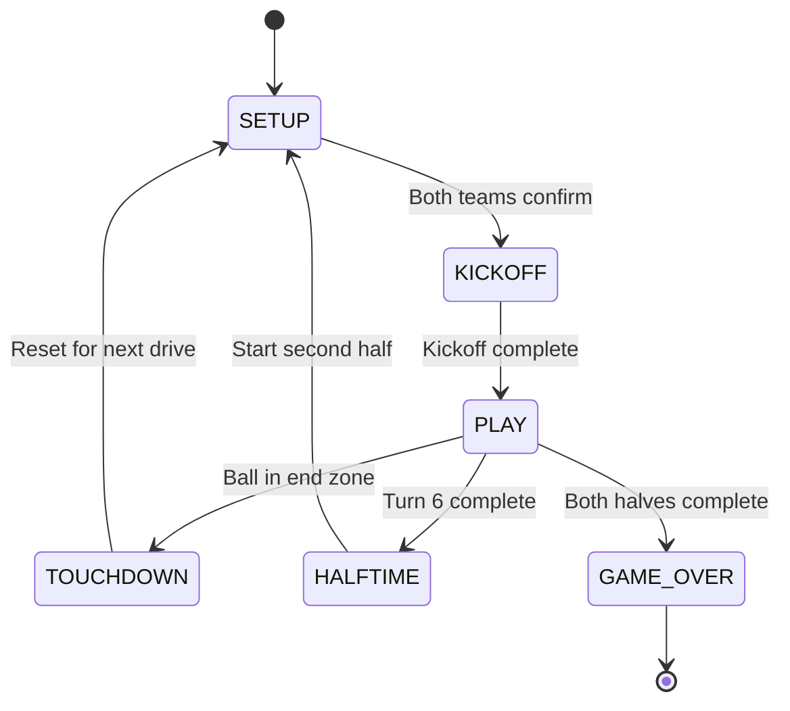

# Game State Management

## Overview

The game state management system tracks all game data, phase transitions, turn management, and player actions throughout a Blood Bowl match.

## GameState Structure

```typescript
interface GameState {
  phase: GamePhase;
  activeTeamId: string | null;
  turn: TurnData;
  score: { [teamId: string]: number };
}
```

### Game Phases

```typescript
enum GamePhase {
  SETUP = "SETUP",        // Pre-game player placement
  KICKOFF = "KICKOFF",    // Kickoff event
  PLAY = "PLAY",          // Active gameplay
  TOUCHDOWN = "TOUCHDOWN", // Touchdown scored
  HALFTIME = "HALFTIME",  // Between halves
  GAME_OVER = "GAME_OVER" // Match complete
}
```

### Turn Data

```typescript
interface TurnData {
  teamId: string;                    // Active team
  turnNumber: number;                // 1-6 (Sevens)
  isHalf2: boolean;                  // First or second half
  activatedPlayerIds: Set<string>;   // Players who acted
  hasBlitzed: boolean;               // Blitz action used
  hasPassed: boolean;                // Pass action used
  hasHandedOff: boolean;             // Hand-off used
  hasFouled: boolean;                // Foul action used
}
```

## Phase Transitions



## GameStateManager

The `GameStateManager` class orchestrates all state transitions and validates actions.

### Key Responsibilities

1. **Setup Phase Management**
   - Track player placement
   - Validate formations
   - Confirm team readiness

2. **Turn Management**
   - Start/end turns
   - Track active team
   - Manage turn counts
   - Handle half transitions

3. **Action Tracking**
   - Track activated players
   - Enforce one-action-per-player rule
   - Track special actions (blitz, pass, etc.)

4. **Validation**
   - Validate player placement
   - Check action legality
   - Enforce game rules

### State Transitions

#### Setup → Kickoff
```typescript
// Both teams must place 7 players and confirm
confirmSetup(teamId: string): void {
  this.state.setupConfirmed[teamId] = true;
  
  if (this.isSetupComplete(team1.id) && this.isSetupComplete(team2.id)) {
    this.startKickoff();
  }
}
```

#### Kickoff → Play
```typescript
startGameAfterKickoff(): void {
  this.state.phase = GamePhase.PLAY;
  this.startTurn(this.receivingTeam.id);
}
```

#### Turn End
```typescript
endTurn(): void {
  const currentTeam = this.state.turn.teamId;
  const nextTeam = currentTeam === this.team1.id 
    ? this.team2.id 
    : this.team1.id;
  
  this.startTurn(nextTeam);
}
```

## Player Placement

During setup phase, players are placed on the pitch grid.

### Placement Rules
- Must be in own half of pitch
- Cannot overlap with other players
- Must place exactly 7 players (Sevens)
- Valid grid positions only

### Placement Tracking
```typescript
interface PlayerPlacement {
  playerId: string;
  gridX: number;
  gridY: number;
}

// Stored in game state
placedPlayers: Map<string, PlayerPlacement>
```

## Turn Management

### Turn Structure
1. **Start Turn**: Reset turn data, set active team
2. **Player Actions**: Players perform actions
3. **Turnover Check**: Check for turnover conditions
4. **End Turn**: Switch to other team

### Turnover Conditions
- Player falls (failed dodge, GFI, etc.)
- Failed pickup
- Failed pass
- Failed catch
- Touchdown scored

### Action Limits
- Each player: 1 action per turn
- Team: 1 blitz per turn
- Team: 1 pass per turn
- Team: 1 hand-off per turn
- Team: 1 foul per turn

## State Persistence

Currently, state is only held in memory. Future improvements:

### Planned Features
- Save/load game state
- Replay system
- Undo/redo actions
- State history for debugging

### State Serialization
```typescript
interface SerializedGameState {
  version: string;
  timestamp: number;
  gameState: GameState;
  team1: Team;
  team2: Team;
  history: GameAction[];
}
```

## Event System (Planned)

Future architecture will use event-driven state updates:

```typescript
// State changes emit events
eventBus.emit('game:phaseChanged', { 
  from: GamePhase.SETUP, 
  to: GamePhase.KICKOFF 
});

eventBus.emit('turn:started', { 
  teamId: team1.id, 
  turnNumber: 1 
});

eventBus.emit('player:activated', { 
  playerId: 'player-123' 
});
```

## Testing State Management

### Unit Tests
```typescript
describe('GameStateManager', () => {
  it('should initialize in SETUP phase', () => {
    const manager = new GameStateManager(team1, team2);
    expect(manager.getState().phase).toBe(GamePhase.SETUP);
  });

  it('should transition to KICKOFF when setup complete', () => {
    const manager = new GameStateManager(team1, team2);
    // Place and confirm both teams
    manager.confirmSetup(team1.id);
    manager.confirmSetup(team2.id);
    expect(manager.getState().phase).toBe(GamePhase.KICKOFF);
  });
});
```

## Related Documentation

- [Architecture](./architecture.md)
- [Scene Flow](./scene-flow.md)
- [Testing Strategy](./testing-strategy.md)

---

**Last Updated**: 2025-12-05
