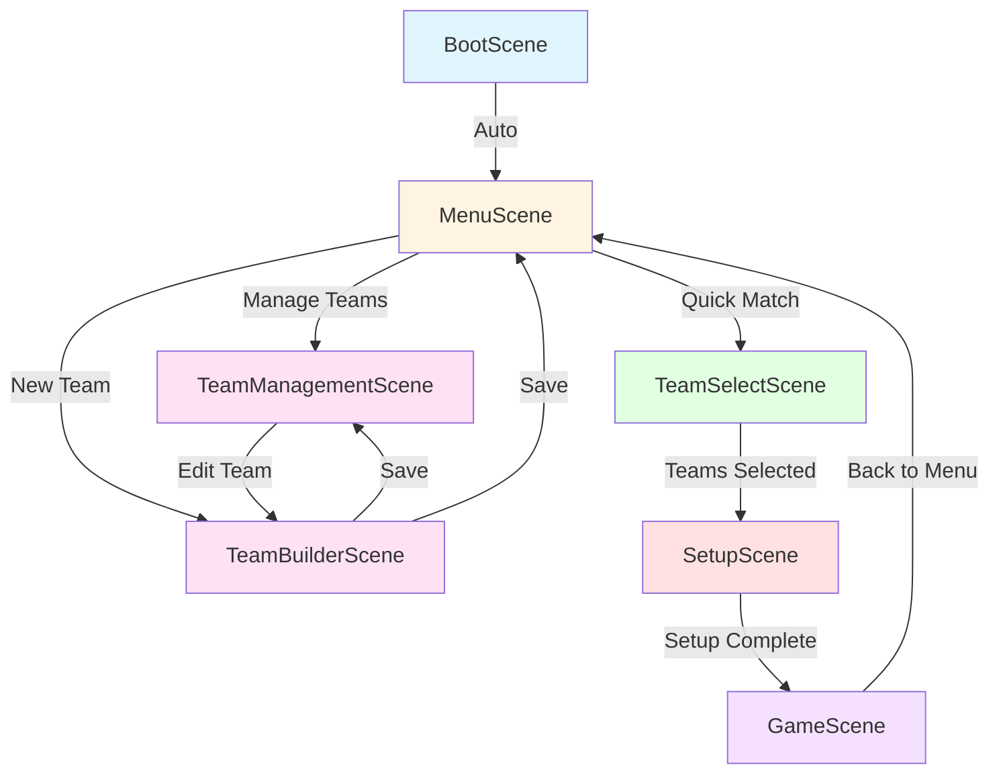

# Scene Flow

## Overview

The Blood Bowl Phaser.js game uses Phaser's scene system to organize different game states and UI screens. This document describes the flow between scenes and their responsibilities.

## Scene Diagram



## Scene Details

### BootScene

**Purpose**: Initial game loading and setup

**Responsibilities**:

- Initialize Phaser
- Load initial assets
- Set up global configurations
- Auto-transition to MenuScene

**Data Passed**: None

**Lifecycle**:

```typescript
create() {
  // Load assets
  // Initialize configs
  this.scene.start('MenuScene');
}
```

---

### MenuScene

**Purpose**: Main menu and navigation hub

**Responsibilities**:

- Display game title and options
- Navigate to team management
- Start quick match
- Show settings (future)

**UI Elements**:

- Title text
- "New Game" button → TeamSelectScene
- "Manage Teams" button → TeamManagementScene
- "Create Team" button → TeamBuilderScene
- "Settings" button (future)

**Data Passed**: None

---

### TeamManagementScene

**Purpose**: View and manage existing teams

**Responsibilities**:

- List all saved teams
- Edit existing teams
- Delete teams
- Navigate to team builder

**UI Elements**:

- Team list
- Edit buttons
- Delete buttons
- "Create New Team" button

**Data Passed**:

- To TeamBuilderScene: `{ team: Team }` (for editing)

---

### TeamBuilderScene

**Purpose**: Create or edit a team

**Responsibilities**:

- Select roster type
- Buy players
- Purchase re-rolls
- Hire staff
- Validate budget (600k for Sevens)
- Save team

**UI Elements**:

- Roster selection
- Player purchase UI
- Budget display
- Re-roll purchase
- Save/Cancel buttons

**Data Received**:

- `{ team?: Team }` (if editing existing team)

**Data Passed**:

- Back to TeamManagementScene: Updated team saved

**Validation**:

- Must have 7-11 players
- Cannot exceed 600k budget
- Valid roster selection

---

### TeamSelectScene

**Purpose**: Select two teams for a match

**Responsibilities**:

- Display available teams
- Select team 1
- Select team 2
- Validate selections (different teams)
- Proceed to setup

**UI Elements**:

- Team 1 selection dropdown
- Team 2 selection dropdown
- Team preview panels
- "Start Match" button

**Data Passed**:

- To SetupScene: `{ team1: Team, team2: Team }`

---

### SetupScene

**Purpose**: Pre-game setup and player placement

**Responsibilities**:

- Perform coin flip for kickoff
- Allow player placement
- Validate formations
- Confirm team readiness
- Transition to game

**UI Elements**:

- Pitch grid
- Player dugouts
- Formation selector
- Confirm button
- Placement indicators

**Data Received**:

- `{ team1: Team, team2: Team }`

**Data Passed**:

- To GameScene:

  ```typescript
  {
    team1: Team,
    team2: Team,
    kickingTeam: Team,
    receivingTeam: Team,
    gameStateManager: GameStateManager
  }
  ```

**Setup Flow**:

1. Coin flip determines kicking team
2. Receiving team places players first
3. Kicking team places players
4. Both teams confirm
5. Transition to GameScene

---

### GameScene

**Purpose**: Main gameplay

**Responsibilities**:

- Display pitch and players
- Handle player selection
- Manage turns
- Execute actions
- Track score
- Show player info
- Handle game end

**UI Elements**:

- Pitch with grid
- Player sprites
- Turn indicator
- Score display
- Player info panel
- Action buttons
- End turn button

**Data Received**:

```typescript
{
  team1: Team,
  team2: Team,
  kickingTeam: Team,
  receivingTeam: Team,
  gameStateManager: GameStateManager
}
```

**Game Loop**:

1. Display initial setup
2. Perform kickoff
3. Start first turn
4. Handle player actions
5. End turn / check turnover
6. Repeat until game end
7. Show final score
8. Return to menu

---

## Scene Communication

### Starting a Scene

```typescript
// Simple start
this.scene.start("MenuScene");

// Start with data
this.scene.start("SetupScene", {
  team1: selectedTeam1,
  team2: selectedTeam2,
});
```

### Receiving Data

```typescript
class SetupScene extends Phaser.Scene {
  init(data: { team1: Team; team2: Team }) {
    this.team1 = data.team1;
    this.team2 = data.team2;
  }
}
```

### Stopping Scenes

```typescript
// Stop current scene and start new one
this.scene.start("GameScene", data);

// Stop without starting new scene
this.scene.stop();
```

## Scene Lifecycle

Each Phaser scene has these lifecycle methods:

```typescript
class ExampleScene extends Phaser.Scene {
  // 1. Receive data from previous scene
  init(data) {
    this.data = data;
  }

  // 2. Load assets (if needed)
  preload() {
    this.load.image("sprite", "path/to/sprite.png");
  }

  // 3. Create scene objects
  create() {
    this.add.text(100, 100, "Hello");
  }

  // 4. Update every frame (if needed)
  update(time: number, delta: number) {
    // Game logic
  }

  // 5. Clean up when scene stops
  shutdown() {
    // Remove listeners, etc.
  }
}
```

## Best Practices

### DO

✅ Pass only necessary data between scenes
✅ Clean up event listeners in `shutdown()`
✅ Validate data in `init()`
✅ Keep scenes focused on presentation
✅ Use GameStateManager for game logic

### DON'T

❌ Store game state in scenes
❌ Create circular scene dependencies
❌ Pass entire game state between scenes
❌ Mix business logic with presentation
❌ Forget to clean up resources

## Future Improvements

### Planned Enhancements

1. **Scene Manager Service**: Centralized scene navigation
2. **Scene Transitions**: Fade in/out effects
3. **Loading Screens**: Show progress for asset loading
4. **Modal Overlays**: In-game menus without scene changes
5. **Scene Stack**: Support for scene layering

## Related Documentation

- [Architecture](./architecture.md)
- [Game State](./game-state.md)
- [Testing Strategy](./testing-strategy.md)

---

**Last Updated**: 2025-12-05
